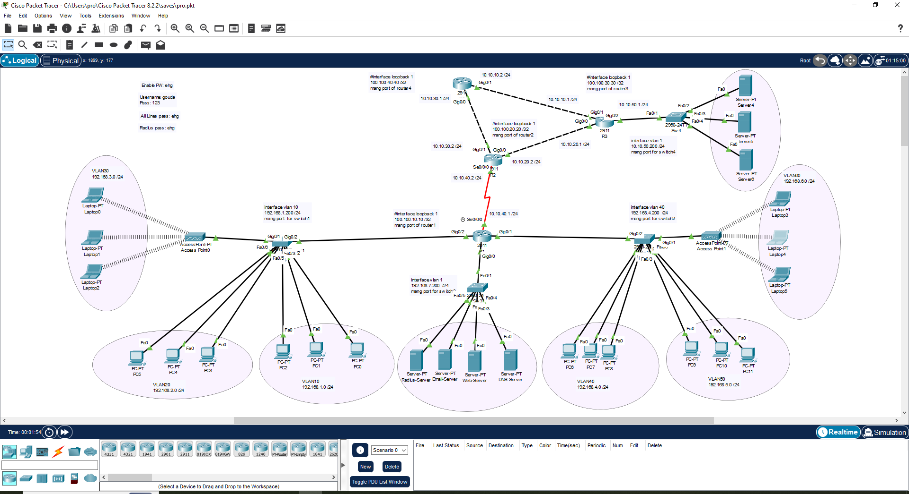

# 🧠 CCNA Final Network Design Project

This project simulates a **complete enterprise network infrastructure** using Cisco Packet Tracer, applying core **CCNA** concepts such as VLANs, routing, server integration, and secure network access.

---

## 📌 Project Overview

The network is designed to represent a **medium-sized organization** with multiple departments, servers, and secure wireless access.

---

## 📸 Screenshot

---

It includes:

- 🔀 Multiple VLANs for department isolation  
- 🌐 Inter-VLAN Routing using Layer 3 Switches  
- 🔒 RADIUS Server for wireless authentication  
- 📡 Wireless Access Points with SSID security  
- 🖥️ Integrated servers: Web, Email, DNS, RADIUS  
- 🌍 Static routing and loopback interfaces for management and testing  
- ⚙️ Full IP subnetting and address planning  
- 🔌 Physical & logical topology representation

---

## 📊 Topology Highlights

### 🧱 VLANs & Subnets

| VLAN | Department      | Subnet             |
|------|------------------|--------------------|
| 10   | Management       | 192.168.1.0/24     |
| 20   | IT Support       | 192.168.2.0/24     |
| 30   | Wireless A       | 192.168.3.0/24     |
| 40   | Wireless B       | 192.168.4.0/24     |
| 50   | General Staff    | 192.168.5.0/24     |
| 60   | Admin / Servers  | 192.168.6.0/24     |

---

### 🔁 Routing

- **Routers:** R1, R2, R3 with multiple interfaces and static routes  
- **Loopback Interfaces:** For management and simulation  
- **Redundant Paths:** Backup links between routers for failover testing  
- **Routing Table Control:** Manual static entries for visibility

---

### 📡 Wireless Access

- Two Access Points, each connected to separate VLANs  
- Secured via **RADIUS Authentication Server**  
- User credentials stored in centralized server

---

### 🖥️ Servers Deployed

| Server Type     | Function                |
|------------------|-------------------------|
| RADIUS Server    | 802.1x Authentication   |
| Web Server       | HTTP/HTTPS Hosting      |
| Email Server     | SMTP Simulation         |
| DNS Server       | Internal Name Resolution |

---

### 🔐 Security Features

- VLAN segmentation to isolate traffic  
- Password-protected devices (enable/console/VTY)  
- Centralized login via RADIUS  
- Management interfaces restricted to specific subnets

---

## 🚀 Tools & Technologies

- Cisco Packet Tracer 8.2.1  
- Cisco Routers: 4331, 2911  
- Cisco Switches: 2960  
- Protocols: Static Routing, VLAN, 802.1X, DHCP, DNS, HTTP, SMTP  
- Topology: Hybrid (Star + Mesh)

---

## 👨‍💻 Author

**Elham Hasan**  
- 💼 [LinkedIn](https://www.linkedin.com/in/elham-hasan-6b029433a)  
- 📧 elhamhassan252@gmail.com  
- 🛠️ ITI DevOps Track | RHCSA Certified  

---

> This project is a demonstration of my understanding and hands-on experience with CCNA-level networking and real-world infrastructure simulation.
